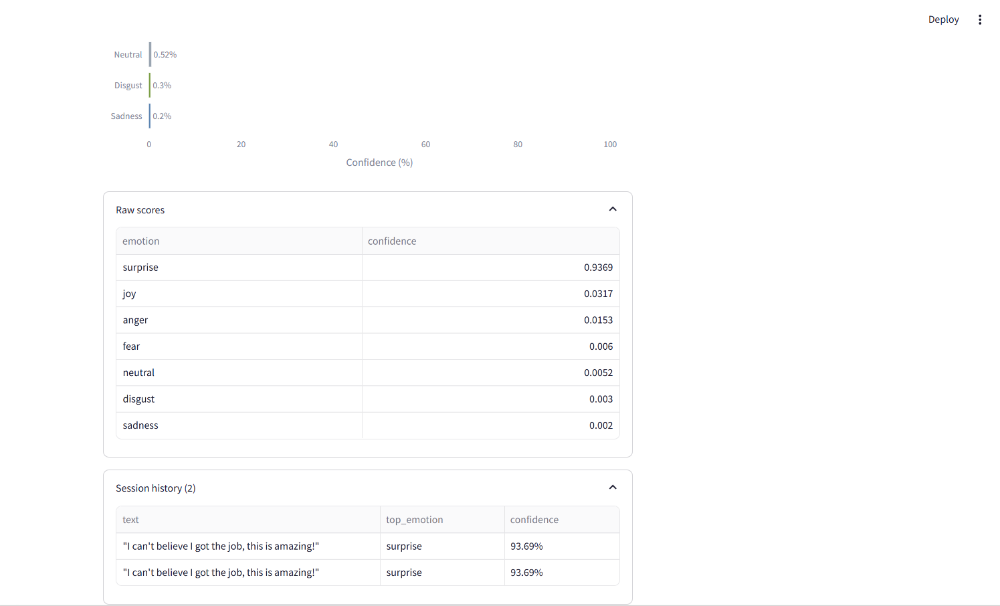

# 🎭 Emotion AI - Text Emotion Classifier

[](https://www.python.org/)
[](https://streamlit.io/)
[](https://huggingface.co/docs/transformers)
[](#run-tests)
[](LICENSE)

A production-structured **Streamlit application** that classifies text into one of seven emotions using a fine-tuned transformer model. Built with a layered architecture, typed exception handling, and full unit test coverage - the kind of codebase a real product team would expect to see in a code review, not a single-file notebook demo.

**Live demo:** _add Streamlit Community Cloud link here once deployed_

---

## Preview

| Single-Text Analysis | Confidence Breakdown | Batch CSV Processing |
|---|---|---|
|  |  |  |

---

## Overview

The app classifies free-text input into one of seven emotions - **joy, sadness, anger, fear, surprise, disgust, neutral** - using [`j-hartmann/emotion-english-distilroberta-base`](https://huggingface.co/j-hartmann/emotion-english-distilroberta-base), a DistilRoBERTa model fine-tuned for emotion classification.

It started as a 40-line proof-of-concept script and was refactored into a layered architecture with input validation, typed error handling, unit tests, and batch processing support - demonstrating not just model usage but sound software engineering practice around an ML component.

## Key Features

- **Single-text analysis** - enter any sentence and get the top predicted emotion plus a full confidence breakdown as an interactive bar chart
- **Batch analysis via CSV upload** - classify up to 200 rows at once (e.g. reviews, survey responses, support tickets) and export results as CSV
- **Low-confidence flagging** - surfaces uncertainty instead of presenting a weak prediction as a confident answer
- **Session history** - tracks every analysis run within the current session
- **Graceful error handling** - model load failures, oversized input, and malformed CSVs are caught and shown as clear user-facing messages, not raw stack traces
- **24 unit tests** covering validation, formatting, and the inference engine, using a mocked model so the suite runs without GPU access or a model download

## Architecture

The app is split into focused, independently testable layers rather than one monolithic script:

```
emotion-ai-classifier/
├── app.py                        # Streamlit UI only - layout, input, rendering
├── core/
│   ├── config.py                 # Model settings, thresholds, emotion → color/emoji maps
│   ├── engine.py                 # EmotionEngine: model loading + inference, typed exceptions
│   ├── utils.py                  # Pure functions: validation, formatting (fully unit-testable)
│   └── visualization.py          # Plotly chart builder, decoupled from UI flow
├── tests/
│   ├── test_engine.py            # Engine tests with a mocked transformers pipeline
│   └── test_utils.py             # Validation & formatting tests
├── .github/workflows/ci.yml      # Lint + test on every push
├── Dockerfile                    # Model pre-downloaded at build time
├── requirements.txt
└── requirements-dev.txt
```

**Why this structure?**

- `core/engine.py` never imports `streamlit`, so it can be unit-tested with a mocked model in milliseconds
- `core/utils.py` has zero dependency on Streamlit or transformers — pure functions in, pure values out
- `app.py` contains no bare `try/except` blocks — it only ever catches the typed `ValidationError`, `InferenceError`, and `ModelLoadError` raised by the lower layers

## Design Decisions

- **Validate before inference** — empty or oversized text never reaches the model; the user gets a clear message instead of a crash or a hang
- **Typed exceptions over raw tracebacks** — model load failures and inference errors are caught and surfaced as readable messages
- **Confidence shown as a sorted bar chart**, not a list of raw scores, so it's easy to see at a glance which emotions the model considered plausible and by how much
- **Low-confidence flagging** built into the UI so uncertain predictions are never presented as fact
- **Batch mode designed for realistic use** — a single text box is a demo; CSV upload with downloadable results reflects how this would actually be used to triage reviews or support tickets

## Tech Stack

| Layer | Choice |
|---|---|
| UI | Streamlit |
| Model | Hugging Face Transformers (`j-hartmann/emotion-english-distilroberta-base`) |
| Charting | Plotly |
| Data handling | Pandas |
| Testing | pytest, unittest.mock |
| Linting | Ruff |
| CI | GitHub Actions |
| Deployment | Docker |

## Getting Started

### Prerequisites

- Python 3.11+
- ~500 MB free disk space (model weights, downloaded on first run)

### Installation

```bash
git clone https://github.com/Chowdri-Furkhan07/emotion-ai-classifier.git
cd emotion-ai-classifier
python -m venv venv
source venv/bin/activate   # Windows: venv\Scripts\activate
pip install -r requirements.txt
```

### Run Locally

```bash
streamlit run app.py
```

The app opens at `http://localhost:8501`. The model downloads automatically on first run (~300 MB) and is cached afterward.

### Run with Docker

```bash
docker build -t emotion-ai .
docker run -p 8501:8501 emotion-ai
```

The model is pre-downloaded at build time, so the container runs correctly even without internet access at runtime.

### Run Tests

```bash
pip install -r requirements-dev.txt
pytest tests/ -v --cov=core
```

Tests mock the `transformers` pipeline directly, so the full suite runs in under a second with no model download required.

## Batch CSV Format

Upload a CSV with a `text` column:

```csv
text
"I can't believe I got the job, this is amazing!"
"The delay in shipping has been really frustrating."
"I'm not sure how I feel about this update."
```

Results (top emotion + confidence per row) can be downloaded directly from the app as CSV.

## Roadmap

- [ ] Multi-language emotion detection
- [ ] Sentence-level breakdown for multi-sentence input
- [ ] Streamlit Community Cloud deployment with live demo link

## License

Released under the [MIT License](LICENSE).

## Author

**Chowdri Furkhan**
[GitHub](https://github.com/Chowdri-Furkhan07) · [LinkedIn](https://linkedin.com/in/chowdri-furkhan/)
